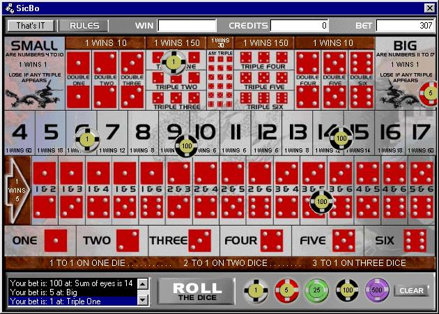



## SICBO \-Chinese gambling Game\-

### Description

This chinese game with three dices let you have some nice hours of free playing time.. all you will win is the sourcecode :-))
 
### More Info
 
The game uses DirectX Sound, but due to the very poor error handling, the game will sometimes crash whe you play a sound on the background (e.g. winamp or so...)

             |
---                |---
**Submitted On**   |2001-04-08 21:33:48
**By**             |[Paul Leyten](https://github.com/Planet-Source-Code/PSCIndex/blob/master/ByAuthor/paul-leyten.md)
**Level**          |Intermediate
**User Rating**    |5.0 (15 globes from 3 users)
**Compatibility**  |VB 5\.0, VB 6\.0
**Category**       |[Games](https://github.com/Planet-Source-Code/PSCIndex/blob/master/ByCategory/games__1-38.md)
**World**          |[Visual Basic](https://github.com/Planet-Source-Code/PSCIndex/blob/master/ByWorld/visual-basic.md)
**Archive File**   |[SICBO \-Chi18091482001\.zip](https://github.com/Planet-Source-Code/paul-leyten-sicbo-chinese-gambling-game__1-22232/archive/master.zip)

